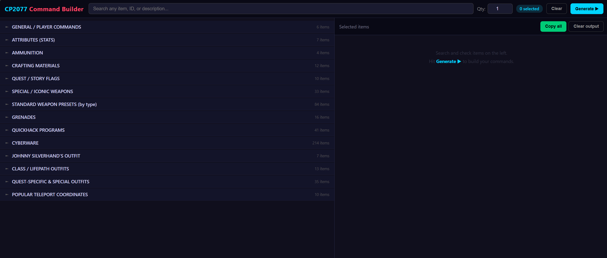
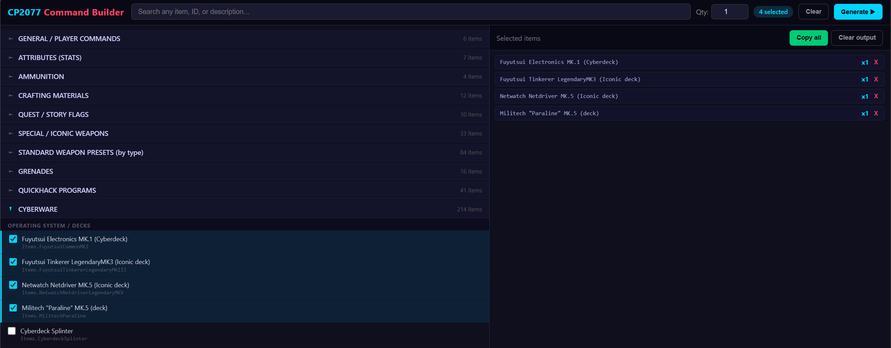
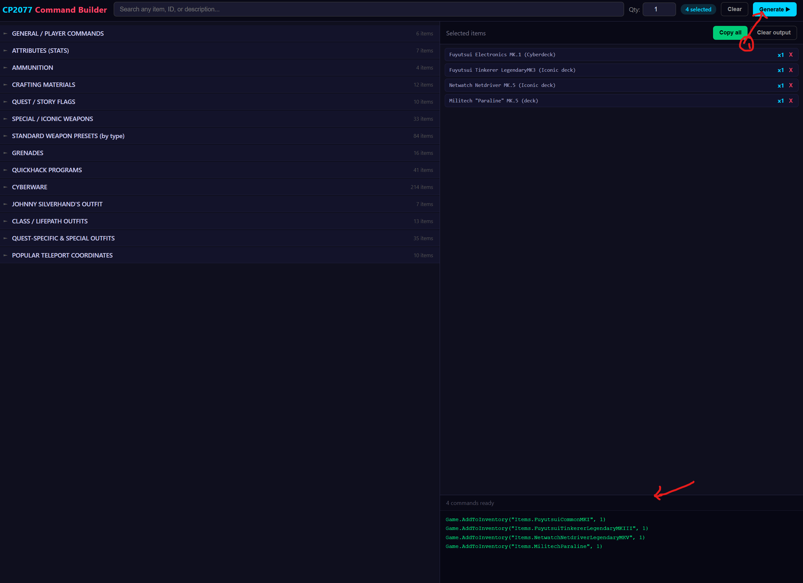
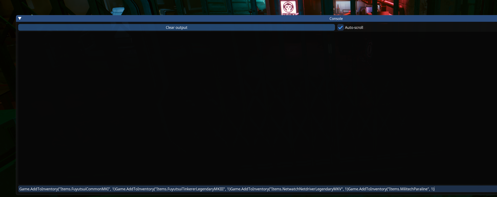

# CP2077 Command Builder

A browser-based tool for building and copying **Cyber Engine Tweaks (CET)** console commands for Cyberpunk 2077. Search, select, and generate multi-item command blocks with one click - no more typing commands manually.






---

## Features

- **492 commands** across 14 sections - fully parsed from a plain-text data file
- **Sections collapsed by default** - only expands what you open, so it never feels overwhelming
- **Live search** - type any keyword and matching items auto-expand across all sections
- **Multi-select** - tick as many items as you want, set your quantity, hit Generate
- **One-click copy** - paste the whole block straight into CET in-game
- **No install, no dependencies** - single HTML file, works offline in any browser

---

## Usage

### Option A — Just open the HTML (no build needed)

```
index.html   ← open this in any browser
```

### Option B — Rebuild from source (after editing the data file)

Requires Python 3.6+, no third-party packages needed.

```bash
python src/build.py
```

This parses `data/commands.txt` and regenerates `index.html`.

---

## Project Structure

```
cp77-command-builder/
├── index.html                  # The ready-to-use tool (open in browser)
├── data/
│   └── commands.txt            # All commands in human-readable table format
├── src/
│   └── build.py                # Parser — reads commands.txt, generates index.html
├── docs/
│   └── screenshot.png          # Screenshot for README
├── .gitignore
└── README.md
```

---

## Adding or Editing Commands

All commands live in **`data/commands.txt`** in a simple pipe-separated table format:

```
================================================================
 SECTION N — YOUR SECTION NAME
================================================================

COMMAND                              | WHAT IT DOES
-------------------------------------|----------------------------------------------
Game.AddToInventory("Items.Foo", 1)  | Description of what this gives you
Items.Bar                            | Another item (quantity defaults to 1)
```

After editing, run `python src/build.py` to regenerate `index.html`.

> The parser handles three line formats automatically:
> - `Game.AddToInventory("Items.X", N) | description`
> - `Items.X | description` (bare item ID — quantity defaults to 1)
> - `Game.SomeOtherCommand(...) | description` (non-inventory commands)

---

## Requirements

- **In-game**: [Cyber Engine Tweaks](https://www.nexusmods.com/cyberpunk2077/mods/107) mod installed (PC only)
- **This tool**: Any modern browser — Chrome, Firefox, Edge, Safari
- **Rebuilding**: Python 3.6+ (standard library only)

---

## Disclaimer

Console commands require the **Cyber Engine Tweaks** mod and only work on **PC**. Some commands require the **Phantom Liberty DLC**. Always back up your save before using commands. Use at your own risk.

---

## Contributing

1. Fork the repo
2. Edit `data/commands.txt` to add or fix commands
3. Run `python src/build.py` to verify it builds cleanly
4. Open a PR with a description of what you added/changed

Found a wrong item ID or missing command? Open an issue!

---

## License

MIT - free to use, modify, and share.
